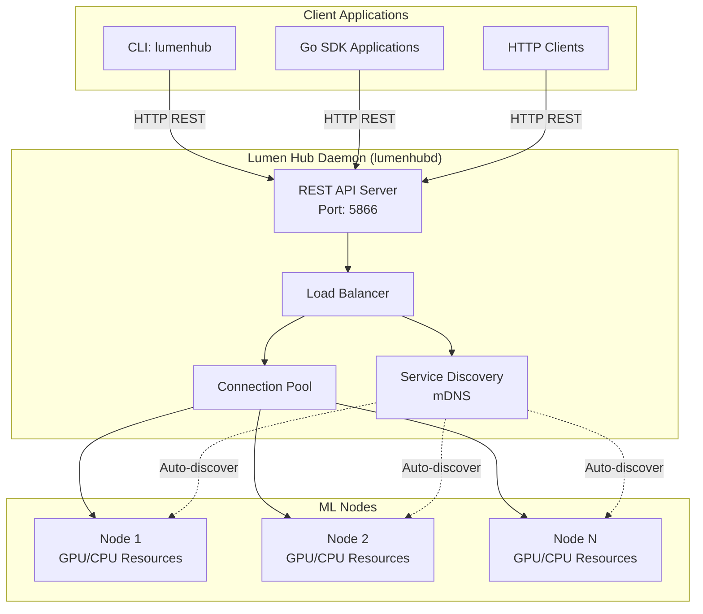

# Lumen SDK

A distributed AI service platform for managing and coordinating Lumen AI inference across multiple nodes.

## Quick Start


### Package Usage

```go
package main

import (
    "context"
    "fmt"
    "log"

    "github.com/edwinzhancn/lumen-sdk/pkg/client"
    "github.com/edwinzhancn/lumen-sdk/pkg/config"
    "github.com/edwinzhancn/lumen-sdk/pkg/types"
)

func main() {
    // Create configuration
    cfg := config.DefaultConfig()

    // Create Lumen client
    lumenClient, err := client.NewLumenClient(cfg, nil)
    if err != nil {
        log.Fatal(err)
    }

    ctx := context.Background()
    if err := lumenClient.Start(ctx); err != nil {
        log.Fatal(err)
    }
    defer lumenClient.Close()

    // Text embedding inference
    textData := []byte("Hello, world!")
    embeddingReq, err := types.NewEmbeddingRequest(textData)
    if err != nil {
        log.Fatal(err)
    }

    inferReq := types.NewInferRequest("text_embedding").
        WithCorrelationID("my_embedding_request").
        ForEmbedding(embeddingReq, "text_embedding").
        Build()

    result, err := lumenClient.Infer(ctx, inferReq)
    if err != nil {
        log.Fatal(err)
    }

    embeddingResp, err := types.ParseInferResponse(result).
        AsEmbeddingResponse()
    if err != nil {
        log.Fatal(err)
    }

    fmt.Printf("Embedding dimensions: %d\n", embeddingResp.DimValue())
    fmt.Printf("First few values: %v\n", embeddingResp.Vector[:5])
}
```

### Retry Support

The SDK also provides automatic retry functionality for handling temporary failures, node discovery, and service availability:

```go
// Basic retry with default settings
resp, err := lumenClient.InferWithRetry(ctx, inferReq)

// Custom retry configuration
resp, err := lumenClient.InferWithRetry(ctx, inferReq,
    client.WithMaxWaitTime(60*time.Second),    // Wait up to 60 seconds
    client.WithRetryInterval(3*time.Second),   // Retry every 3 seconds
    client.WithMaxRetries(10),                  // Maximum 10 retries
    client.WithWaitForTask(true))              // Wait for task to become available

// Check task availability
if lumenClient.IsTaskAvailable("clip_text_embed") {
    resp, err := lumenClient.Infer(ctx, inferReq)
}
```

### Server Usage

**Download Release Binaries**
```bash
# Linux AMD64
curl -L https://github.com/edwinzhancn/lumen-sdk/releases/latest/download/lumenhub-latest-linux-amd64.tar.gz | tar xz
sudo mv lumenhubd lumenhub /usr/local/bin/

# macOS
curl -L https://github.com/edwinzhancn/lumen-sdk/releases/latest/download/lumenhub-latest-darwin-amd64.tar.gz | tar xz
sudo mv lumenhubd lumenhub /usr/local/bin/
```

**Build from Source**
```bash
git clone https://github.com/edwinzhancn/lumen-sdk.git
cd Lumen-SDK
make build && sudo make install-local
```

### Usage
```bash
# Start daemon
./lumenhubd --daemon --preset basic

# Use CLI
./lumenhub status
./lumenhub node list
./lumenhub infer --service embedding --payload-b64 "SGVsbG8gd29ybGQ="
./lumenhub --version
```

## Architecture

- **lumenhubd**: Background daemon service (REST API, node discovery, load balancing)
- **lumenhub**: CLI client for daemon interaction

### Server Architecture



### Supported REST API Services

| Service Name | Endpoint | Description | MIME Types | Streaming Support |
|--------------|----------|-------------|------------|-------------------|
| **embedding** | `POST /v1/infer?service=embedding` | Text/image embedding generation | `text/*`, `image/*` | ✅ `embedding_stream` |
| **classification** | `POST /v1/infer?service=classification` | Image classification | `image/*` | ✅ `classification_stream` |
| **face_detection** | `POST /v1/infer?service=face_detection` | Face detection in images | `image/*` | ✅ `face_detection_stream` |
| **face_recognition** | `POST /v1/infer?service=face_recognition` | Face recognition and embedding | `image/*` | ✅ `face_recognition_stream` |

#### API Endpoints

| Method | Endpoint | Description |
|--------|----------|-------------|
| `GET` | `/v1/health` | Health check |
| `POST` | `/v1/infer` | Universal inference endpoint (all services above) |
| `GET` | `/v1/nodes` | List discovered ML nodes |
| `GET` | `/v1/nodes/:id/capabilities` | Get capabilities of specific node |
| `GET` | `/v1/config` | Get daemon configuration |
| `GET` | `/v1/metrics` | Get performance metrics |
| `GET` | `/v1/tasks` | List all available tasks across all nodes |

#### Example Usage

```bash
# Text embedding
curl -X POST "http://localhost:5866/v1/infer?service=embedding" \
  -H "Content-Type: application/json" \
  -d '{"payload": "SGVsbG8gd29ybGQ=", "payload_mime_type": "text/plain"}'

# Image classification with streaming
curl -N -X POST "http://localhost:5866/v1/infer?service=classification_stream" \
  -H "Content-Type: application/json" \
  -d '{"payload": "base64-encoded-image-data", "payload_mime_type": "image/jpeg"}'

# List all available tasks across all nodes
curl -X GET "http://localhost:5866/v1/tasks" | jq '.data.services'
```

#### Interface Configuration

```yaml
server:
  # REST API - Fully implemented
  rest:
    enabled: true
    host: "0.0.0.0"
    port: 5866

  # MCP (Model Context Protocol) - Coming soon
  mcp:
    enabled: false  # 🚧 Under development
    host: "0.0.0.0"
    port: 6000
```

## Configuration

**Presets**: `minimal` | `basic` | `lightweight` | `brave`

```bash
./lumenhubd --preset basic     # Personal computer
./lumenhubd --config file.yaml # Custom config
```

## Development

```bash
make build          # Build binaries
make test           # Run tests
make ci             # Full CI pipeline
make release        # Create release
```

## License

MIT
