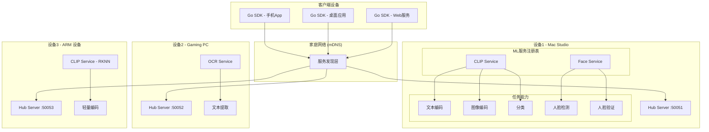
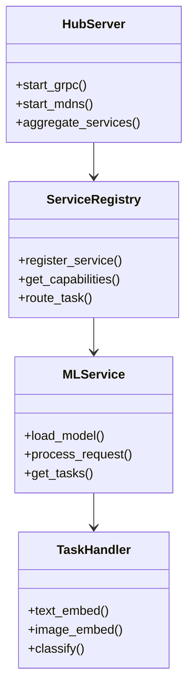
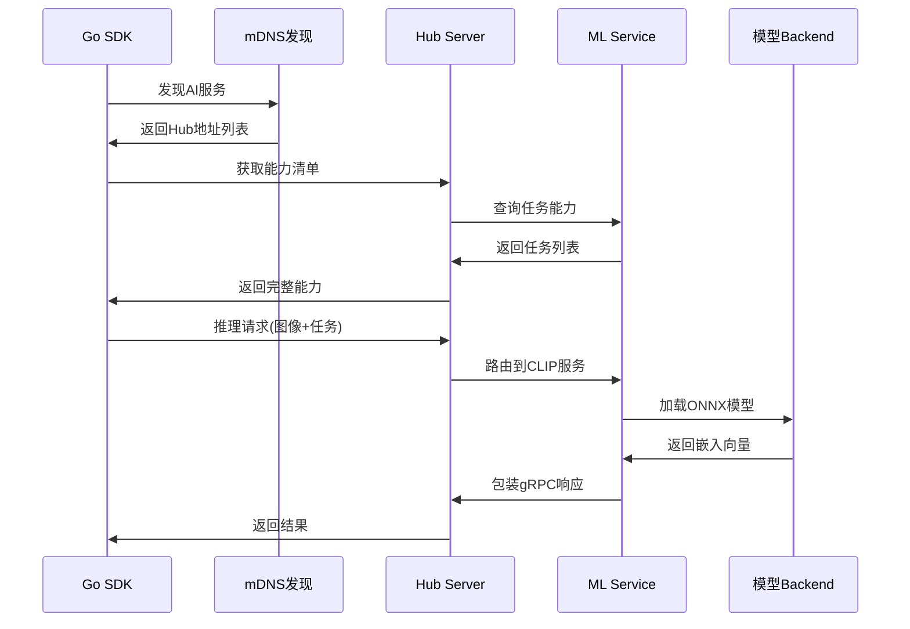
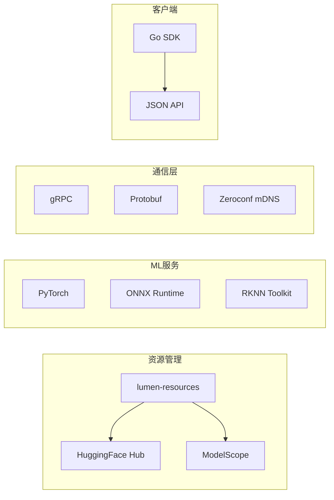

# 🏗️ Lumen 家庭 AI 集群系统蓝图

## 系统架构



## 核心组件

### 1. **统一配置系统**
```yaml
# lumen-config.yaml
hub:
  server:
    port: 50051
    mdns:
      name: "Lumen-AI-Hub-MacStudio"

resources:
  region: "cn"
  cache_dir: "/opt/lumen/models"

services:
  clip:
    enabled: true
    models:
      - model: "MobileCLIP2-S2"
        runtime: "onnx"
      - model: "bioclip-2"
        runtime: "torch"

  face:
    enabled: true
    models:
      - model: "antelopev2"
        runtime: "rknn"
        device: "rk3588"
```

### 2. **服务注册架构**


### 3. **gRPC 数据流**


## 技术栈

### 4. **组件技术选择**


## 部署模式

### 5. **三种部署场景**

**单机模式** - 一台设备运行所有服务
```yaml
# single-node.yaml
services: [clip, face, ocr]
resources: {runtime: "onnx"}  # 统一backend
```

**分布式模式** - 多设备协作
```yaml
# distributed.yaml
cluster:
  nodes:
    - device: "mac-studio"
      services: [clip, face]
      runtime: "torch"
    - device: "gaming-pc"
      services: [ocr]
      runtime: "onnx"
    - device: "arm-device"
      services: [clip-light]
      runtime: "rknn"
```

**边缘模式** - 轻量级部署
```yaml
# edge.yaml
services: [clip]
models: ["MobileCLIP2-S2"]
runtime: "rknn"
optimization: "int8"
```

## 关键特性

### 6. **智能路由**
- **性能路由**: GPU设备处理重任务，CPU处理轻任务
- **负载均衡**: 多个相同服务自动分流
- **故障转移**: 服务不可用时自动切换

### 7. **资源优化**
- **懒加载**: 首次调用时才加载模型
- **模型共享**: 同一模型多个任务共享
- **内存管理**: LRU缓存策略

### 8. **零配置体验**
```bash
# 用户体验
lumen-hub init clip,face  # 生成配置
lumen-hub start           # 一键启动
# Go SDK自动发现服务，无需配置地址
```

## 实现路线图

**Phase 1**: 核心框架
- ✅ lumen-resources (已完成)
- 🚧 统一配置解析
- 🚧 Service Registry

**Phase 2**: 服务实现
- 🚧 lumen-clip 完善
- ⏳ lumen-face 开发
- ⏳ lumen-ocr 开发

**Phase 3**: 集群功能
- ⏳ Hub Server
- ⏳ mDNS 集成
- ⏳ Go SDK

**Phase 4**: 高级特性
- ⏳ 模型热重载
- ⏳ 性能监控
- ⏳ 自动优化

这个蓝图的核心价值是**将复杂的AI服务变成像家用路由器一样简单的即插即用设备**，让普通用户也能在家中部署私有AI集群。
