# Lumen SDK 数据流分析

## 🎯 项目概述

Lumen SDK 是一个分布式AI推理平台，提供统一的接口来处理多种AI任务，包括文本嵌入、目标检测、OCR识别和语音合成。本文档详细分析系统的数据流、架构和使用场景。

## 🏗️ 整体架构

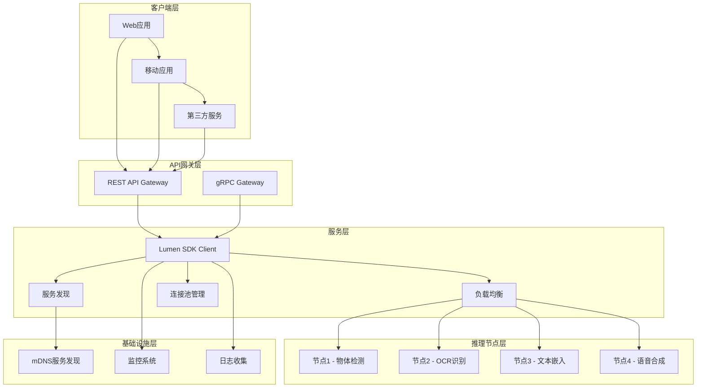

## 🌊 数据流详解

### 1. 请求处理流程

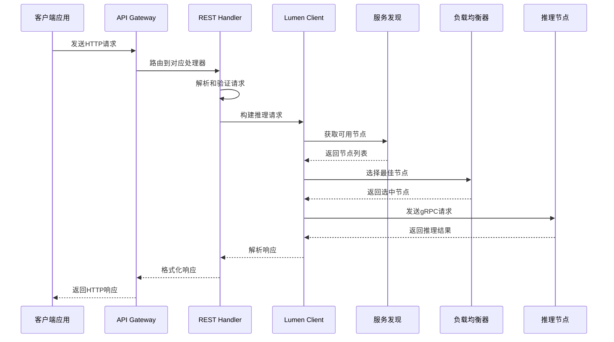

### 2. 服务发现数据流

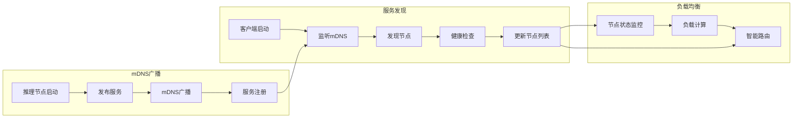

## 📋 具体任务数据流

### 1. 文本嵌入 (Embedding)

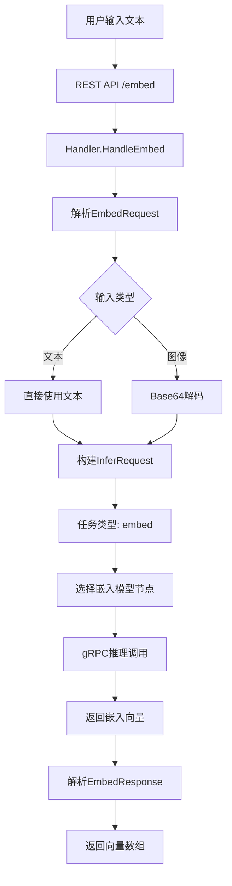

**数据结构示例:**
```json
// 请求
{
  "text": "Hello world",
  "model_id": "text-embedding-ada-002",
  "language": "en"
}

// 响应
{
  "success": true,
  "data": {
    "vector": [0.1, 0.2, 0.3, ...],
    "dimension": 1536,
    "model_id": "text-embedding-ada-002"
  }
}
```

### 2. 目标检测 (Detection)

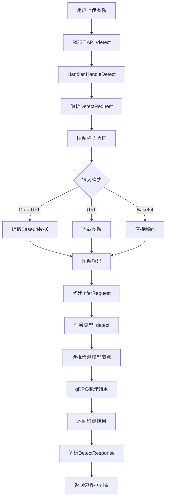

**数据结构示例:**
```json
// 请求
{
  "image": "data:image/jpeg;base64,/9j/4AAQ...",
  "model_id": "yolo-v5",
  "threshold": 0.5,
  "max_results": 100
}

// 响应
{
  "success": true,
  "data": {
    "detections": [
      {
        "box": {"xmin": 100, "ymin": 100, "xmax": 200, "ymax": 200},
        "class_id": 0,
        "class_name": "person",
        "confidence": 0.85
      }
    ],
    "count": 1,
    "model_id": "yolo-v5"
  }
}
```

### 3. OCR文字识别

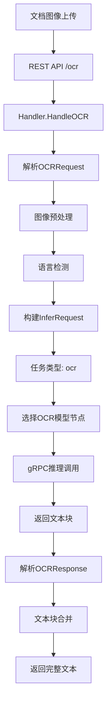

### 4. 语音合成 (TTS)

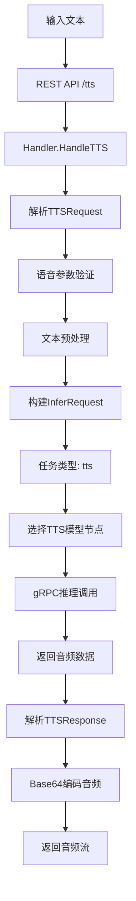

## 🔧 组件间数据流

### 1. Client组件数据流

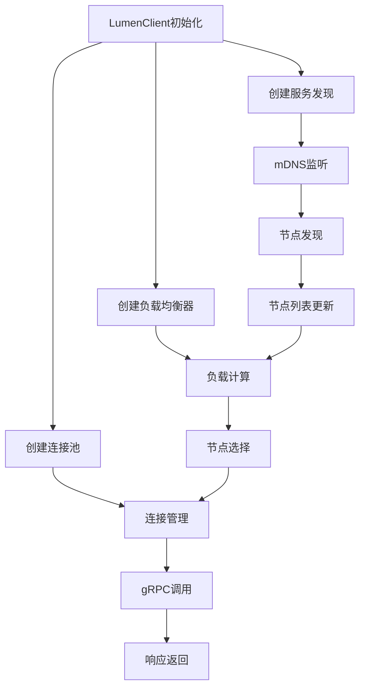

### 2. Codec编解码数据流

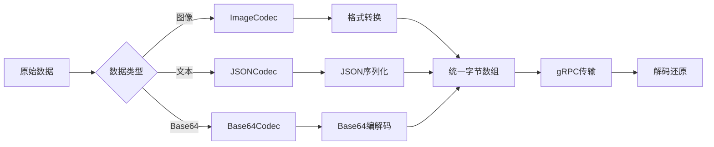

## 📊 性能数据流

### 1. 监控数据收集

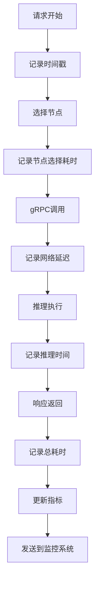

### 2. 负载均衡数据流

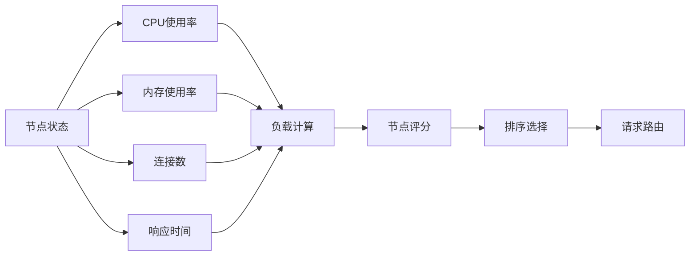

## 🚀 实际使用场景

### 场景1：智能文档处理系统

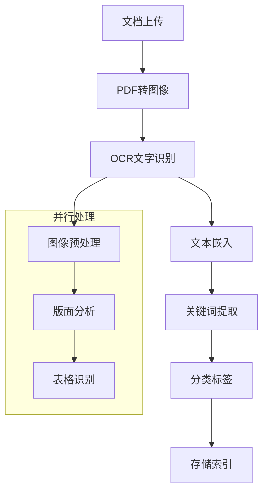

### 场景2：实时视频分析

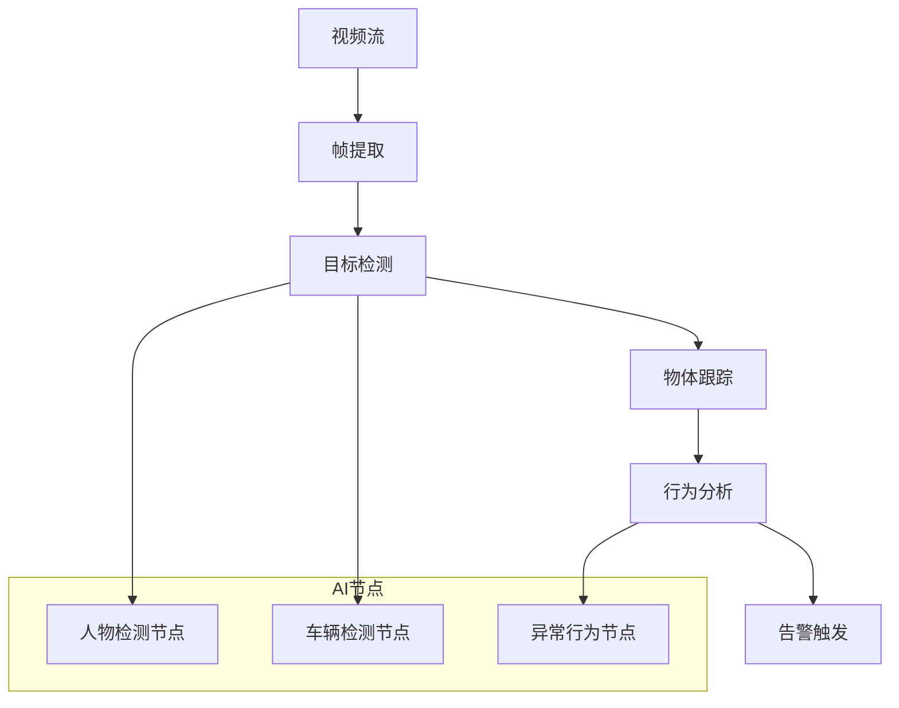

### 场景3：多模态搜索

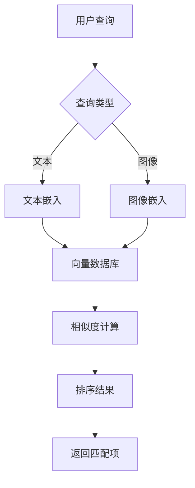

## 🔍 错误处理数据流

### 1. 错误传播流程

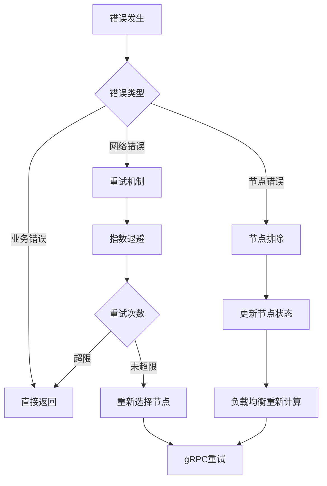

### 2. 熔断机制数据流

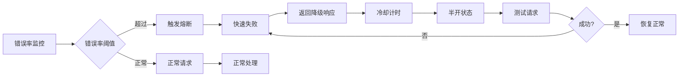

## 📈 扩展性数据流

### 1. 水平扩容流程

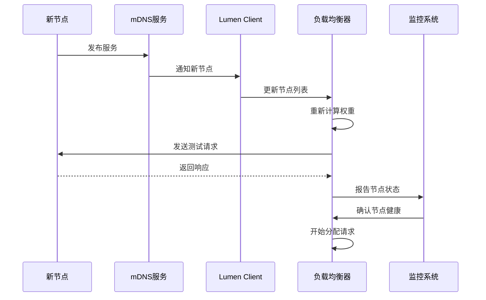

### 2. 功能扩展数据流

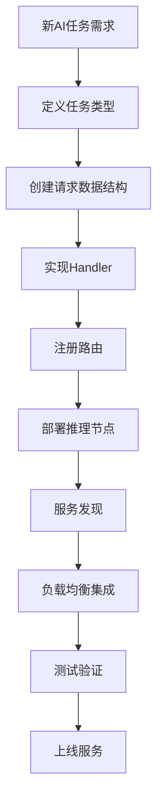

## 🎯 最佳实践数据流

### 1. 请求优化

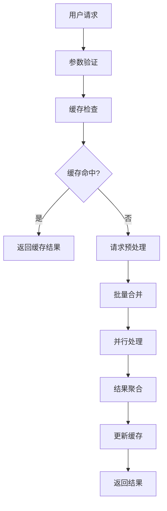

### 2. 资源管理

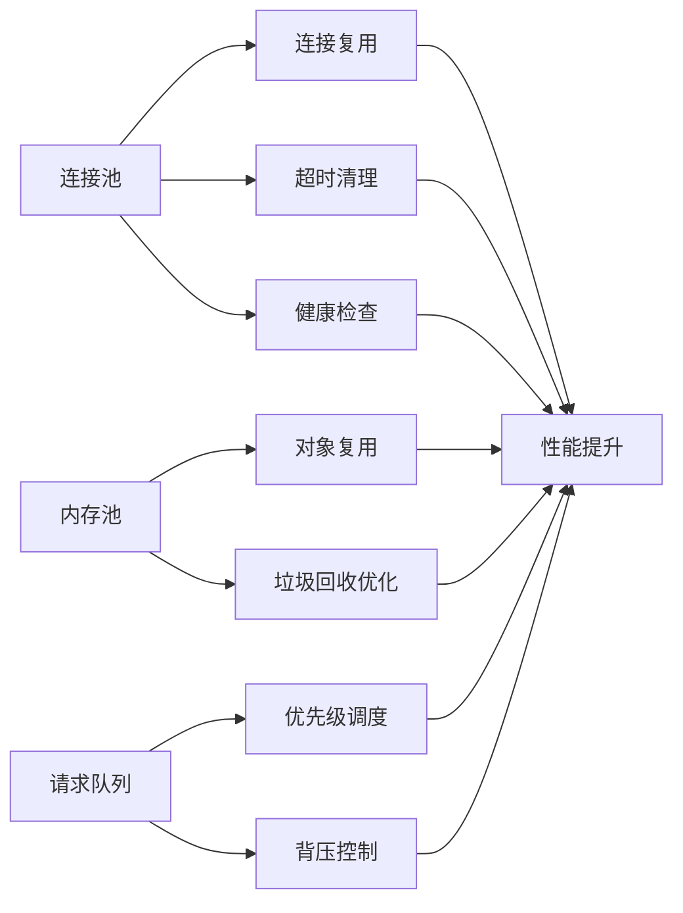

这个数据流分析展示了Lumen SDK的完整架构和各个组件之间的交互关系，为理解系统的工作原理和优化性能提供了详细的指导。