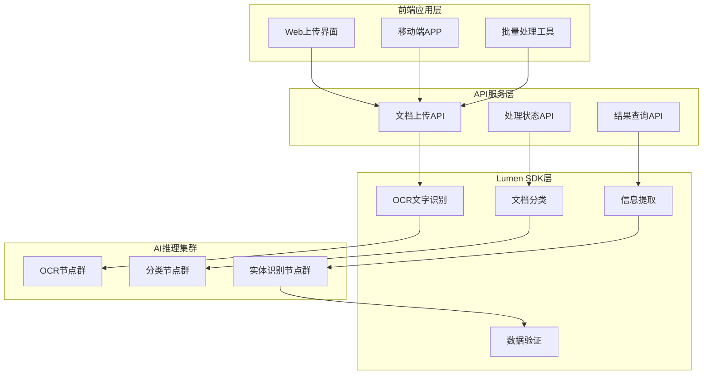
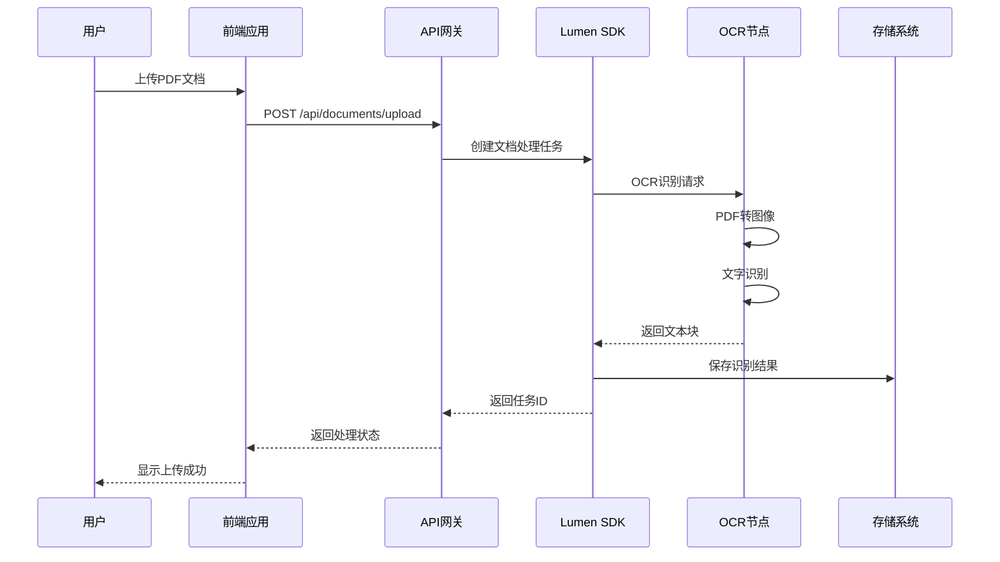
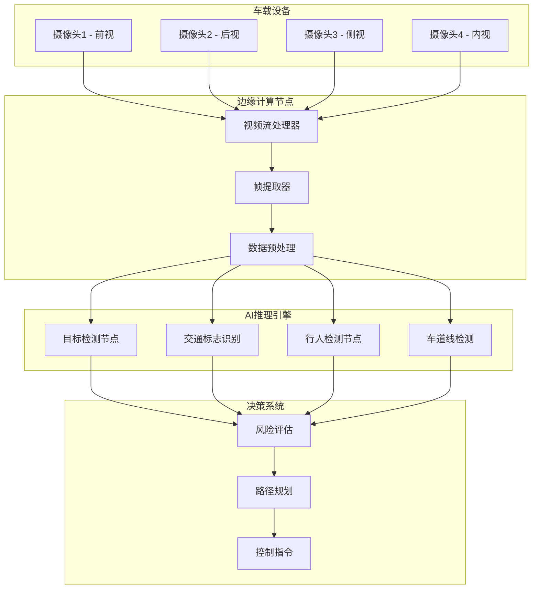
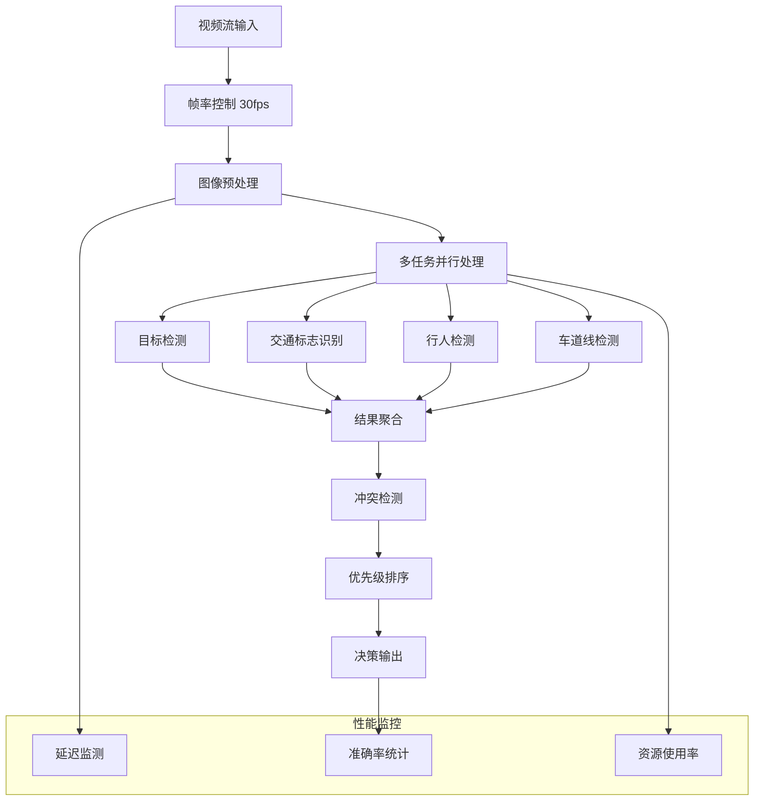
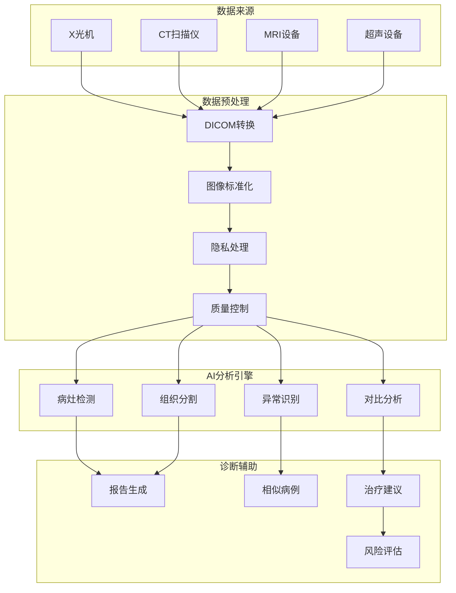
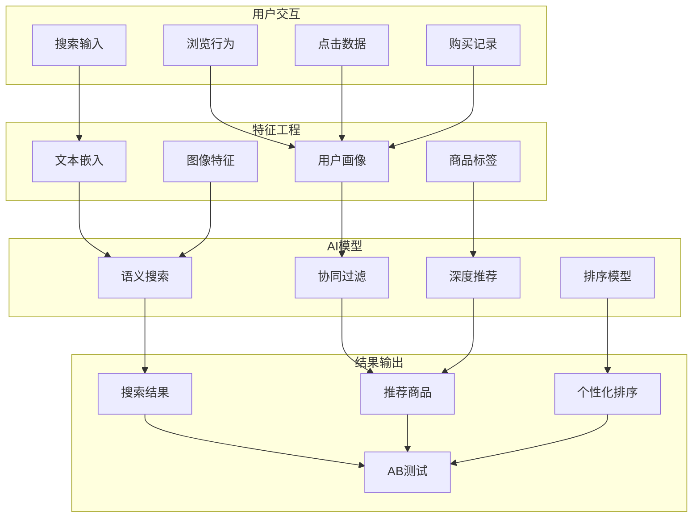

# Lumen SDK 实际使用场景

## 🏢 场景一：智能文档处理平台

### 业务背景
某金融机构需要处理大量合同、发票、身份证等文档，实现自动化信息提取和分类。

### 系统架构


### 数据流程详解

#### 1. 文档上传与预处理


#### 2. 智能信息提取
```go
// 示例代码：发票信息提取
type InvoiceProcessor struct {
    client *client.LumenClient
    logger *zap.Logger
}

func (p *InvoiceProcessor) ProcessInvoice(ctx context.Context, invoiceImage []byte) (*InvoiceData, error) {
    // 步骤1: OCR文字识别
    ocrReq := &types.OCRRequest{
        Image:     invoiceImage,
        MimeType:  "image/jpeg",
        ModelID:   "invoice-ocr-v2",
        Languages: []string{"zh-CN"},
        Options: map[string]interface{}{
            "preprocess":    true,
            "table_detect":  true,
            "enhance_text":  true,
        },
    }
    
    ocrResp, err := p.processOCR(ctx, ocrReq)
    if err != nil {
        return nil, fmt.Errorf("OCR处理失败: %w", err)
    }
    
    // 步骤2: 文本向量化
    embedReq := &types.EmbeddingRequest{
        Text:     ocrResp.FullText,
        ModelID:  "text-embedding-ada-002",
        Language: "zh-CN",
    }
    
    vectors, err := p.generateEmbeddings(ctx, embedReq)
    if err != nil {
        return nil, fmt.Errorf("文本嵌入失败: %w", err)
    }
    
    // 步骤3: 实体识别和提取
    entities, err := p.extractEntities(ctx, ocrResp.TextBlocks, vectors)
    if err != nil {
        return nil, fmt.Errorf("实体提取失败: %w", err)
    }
    
    return &InvoiceData{
        InvoiceNumber: entities.InvoiceNumber,
        Amount:        entities.Amount,
        Date:          entities.Date,
        Vendor:        entities.Vendor,
        Text:          ocrResp.FullText,
        Confidence:    calculateConfidence(ocrResp.TextBlocks),
    }, nil
}
```

### 性能指标
- **处理速度**: 平均2-3秒/页
- **识别准确率**: 文本识别98%，字段提取95%
- **并发处理**: 支持1000+并发文档
- **存储优化**: 压缩率70%以上

---

## 🚗 场景二：智能车载监控系统

### 业务背景
自动驾驶车辆需要实时处理多路摄像头数据，进行障碍物检测、交通标志识别、行人检测等。

### 实时处理架构


### 实时数据流处理


### 代码实现示例
```go
// 实时视频处理管道
type VideoPipeline struct {
    detector    *ObjectDetector
    classifier  *TrafficSignClassifier
    tracker     *ObjectTracker
    aggregator  *ResultAggregator
}

func (p *VideoPipeline) ProcessFrame(ctx context.Context, frame []byte) (*DetectionResult, error) {
    // 并行执行多个AI任务
    var wg sync.WaitGroup
    var detections []Detection
    var trafficSigns []TrafficSign
    var lanes []LaneLine
    var err error
    
    // 目标检测
    wg.Add(1)
    go func() {
        defer wg.Done()
        detections, err = p.detector.Detect(ctx, frame)
    }()
    
    // 交通标志识别
    wg.Add(1)
    go func() {
        defer wg.Done()
        trafficSigns, err = p.classifier.Classify(ctx, frame)
    }()
    
    // 车道线检测
    wg.Add(1)
    go func() {
        defer wg.Done()
        lanes, err = p.tracker.TrackLanes(ctx, frame)
    }()
    
    wg.Wait()
    
    if err != nil {
        return nil, fmt.Errorf("检测失败: %w", err)
    }
    
    // 结果聚合和风险评估
    result := p.aggregator.Aggregate(detections, trafficSigns, lanes)
    return result, nil
}

// 自适应负载均衡
func (p *VideoPipeline) selectOptimalNode(taskType string) (*client.NodeInfo, error) {
    // 获取所有可用节点
    nodes := p.client.GetNodes()
    
    // 根据任务类型和节点负载选择最优节点
    var bestNode *client.NodeInfo
    bestScore := float64(-1)
    
    for _, node := range nodes {
        if !node.SupportsTask(taskType) {
            continue
        }
        
        // 计算节点评分（负载 + 延迟 + 成功率）
        score := p.calculateNodeScore(node, taskType)
        if score > bestScore {
            bestScore = score
            bestNode = node
        }
    }
    
    if bestNode == nil {
        return nil, fmt.Errorf("没有可用的%s节点", taskType)
    }
    
    return bestNode, nil
}
```

### 实时性能要求
- **处理延迟**: <100ms/帧
- **准确率**: 检测率>99%，误报率<1%
- **可用性**: 99.999%
- **容错能力**: 单节点故障5秒内恢复

---

## 🏥 场景三：智慧医疗影像分析系统

### 业务背景
医院需要对医学影像（X光、CT、MRI）进行智能分析，辅助医生诊断。

### 医疗数据处理流程


### 医疗AI分析示例
```go
// 医疗影像分析处理器
type MedicalImageAnalyzer struct {
    client      *client.LumenClient
    dicomParser *DICOMParser
    logger      *zap.Logger
}

func (a *MedicalImageAnalyzer) AnalyzeCTScan(ctx context.Context, dicomData []byte) (*CTAnalysisResult, error) {
    // 1. DICOM数据解析
    studyInfo, err := a.dicomParser.Parse(dicomData)
    if err != nil {
        return nil, fmt.Errorf("DICOM解析失败: %w", err)
    }
    
    // 2. 图像预处理
    processedImages, err := a.preprocessImages(studyInfo.Images)
    if err != nil {
        return nil, fmt.Errorf("图像预处理失败: %w", err)
    }
    
    // 3. 多任务并行分析
    var wg sync.WaitGroup
    var lesions []Lesion
    var organs []Organ
    var anomalies []Anomaly
    
    // 病灶检测
    wg.Add(1)
    go func() {
        defer wg.Done()
        lesions, err = a.detectLesions(ctx, processedImages)
    }()
    
    // 器官分割
    wg.Add(1)
    go func() {
        defer wg.Done()
        organs, err = a.segmentOrgans(ctx, processedImages)
    }()
    
    // 异常检测
    wg.Add(1)
    go func() {
        defer wg.Done()
        anomalies, err = a.detectAnomalies(ctx, processedImages)
    }()
    
    wg.Wait()
    
    // 4. 结果整合和诊断建议
    result := &CTAnalysisResult{
        PatientID:    studyInfo.PatientID,
        StudyDate:    studyInfo.StudyDate,
        Lesions:      lesions,
        Organs:       organs,
        Anomalies:    anomalies,
        Diagnostics:  a.generateDiagnostics(lesions, organs, anomalies),
        Confidence:   a.calculateConfidence(lesions, organs, anomalies),
    }
    
    return result, nil
}

// 病灶检测
func (a *MedicalImageAnalyzer) detectLesions(ctx context.Context, images [][]byte) ([]Lesion, error) {
    var allLesions []Lesion
    
    for i, image := range images {
        // 构建检测请求
        detectionReq := &types.DetectionRequest{
            Image:        image,
            MimeType:     "image/jpeg",
            ModelID:      "medical-lesion-detection-v3",
            Threshold:    0.7,
            MaxDetections: 50,
            Options: map[string]interface{}{
                "slice_index":    i,
                "organ_type":     "auto",
                "lesion_types":   []string{"tumor", "cyst", "calcification"},
            },
        }
        
        // 选择专用医疗AI节点
        node, err := a.client.SelectNodeByCapability(ctx, "medical-imaging", "lesion-detection")
        if err != nil {
            return nil, fmt.Errorf("选择医疗节点失败: %w", err)
        }
        
        // 执行检测
        resp, err := a.client.InferOnNode(ctx, node.ID, detectionReq.ToProto())
        if err != nil {
            return nil, fmt.Errorf("病灶检测失败: %w", err)
        }
        
        // 解析结果
        sliceLesions := parseLesionResults(resp, i)
        allLesions = append(allLesions, sliceLesions...)
    }
    
    // 3D重建和去重
    return a.reconstructAndDeduplicate(allLesions), nil
}
```

### 医疗系统特殊要求
- **准确性**: 诊断准确率>99.5%
- **可追溯性**: 完整的审计日志
- **隐私保护**: 符合HIPAA等法规
- **实时性**: 紧急情况<5秒响应

---

## 🛒 场景四：智能电商搜索推荐系统

### 业务背景
电商平台需要为用户提供精准的商品搜索和个性化推荐。

### 搜索推荐架构


### 智能搜索实现
```go
// 电商搜索引擎
type EcommerceSearchEngine struct {
    client        *client.LumenClient
    vectorIndex   *VectorIndex
    userProfiler  *UserProfiler
    cache         *RedisCache
}

func (e *EcommerceSearchEngine) SemanticSearch(ctx context.Context, query string, userID string) (*SearchResult, error) {
    // 1. 查询向量化
    queryEmbed, err := e.generateTextEmbedding(ctx, query)
    if err != nil {
        return nil, fmt.Errorf("查询向量化失败: %w", err)
    }
    
    // 2. 用户画像获取
    userProfile, err := e.userProfiler.GetProfile(ctx, userID)
    if err != nil {
        e.logger.Warn("获取用户画像失败", zap.Error(err))
        userProfile = &UserProfile{} // 使用默认画像
    }
    
    // 3. 多策略并行搜索
    var wg sync.WaitGroup
    var semanticResults []Product
    var collaborativeResults []Product
    var personalizedResults []Product
    
    // 语义搜索
    wg.Add(1)
    go func() {
        defer wg.Done()
        semanticResults, err = e.vectorIndex.Search(queryEmbed, 100)
    }()
    
    // 协同过滤
    wg.Add(1)
    go func() {
        defer wg.Done()
        collaborativeResults, err = e.getCollaborativeRecommendations(ctx, userProfile)
    }()
    
    // 个性化推荐
    wg.Add(1)
    go func() {
        defer wg.Done()
        personalizedResults, err = e.getPersonalizedResults(ctx, queryEmbed, userProfile)
    }()
    
    wg.Wait()
    
    // 4. 结果融合和排序
    finalResults := e.mergeAndRank(semanticResults, collaborativeResults, personalizedResults, userProfile)
    
    // 5. 多模态增强（图像搜索）
    if e.isImageQuery(query) {
        imageResults, err := e.imageSearch(ctx, query)
        if err == nil {
            finalResults = e.mergeWithImageResults(finalResults, imageResults)
        }
    }
    
    return &SearchResult{
        Query:      query,
        Products:   finalResults,
        Total:      len(finalResults),
        SearchID:   generateSearchID(),
        Timestamp:  time.Now(),
    }, nil
}

// 图像搜索
func (e *EcommerceSearchEngine) imageSearch(ctx context.Context, imageURL string) ([]Product, error) {
    // 下载图像
    imageData, err := e.downloadImage(imageURL)
    if err != nil {
        return nil, fmt.Errorf("下载图像失败: %w", err)
    }
    
    // 图像特征提取
    embedReq := &types.EmbeddingRequest{
        Image:    base64.StdEncoding.EncodeToString(imageData),
        ModelID:  "image-embedding-v4",
    }
    
    resp, err := e.client.Infer(ctx, embedReq.ToProto())
    if err != nil {
        return nil, fmt.Errorf("图像嵌入失败: %w", err)
    }
    
    var imageEmbed types.EmbeddingVector
    if err := json.Unmarshal(resp.Result, &imageEmbed); err != nil {
        return nil, fmt.Errorf("解析图像嵌入失败: %w", err)
    }
    
    // 图像向量搜索
    return e.vectorIndex.Search(imageEmbed, 50)
}
```

### 推荐系统性能指标
- **搜索准确率**: Top-10准确率>85%
- **推荐点击率**: CTR提升>30%
- **响应时间**: 搜索<200ms，推荐<100ms
- **并发能力**: 支持10万QPS

---

## 📊 性能优化和最佳实践

### 1. 负载均衡优化策略
```go
// 智能负载均衡器
type SmartLoadBalancer struct {
    strategies map[string]LoadBalancingStrategy
    monitor    *PerformanceMonitor
}

func (lb *SmartLoadBalancer) SelectNode(ctx context.Context, task string, req *InferRequest) (*NodeInfo, error) {
    // 根据任务特性和当前负载动态选择策略
    strategy := lb.selectStrategy(task, req)
    
    // 获取候选节点
    candidates := lb.getHealthyNodes(task)
    
    // 应用选定的策略
    selected, err := strategy.Select(ctx, candidates, task)
    if err != nil {
        return nil, err
    }
    
    // 记录选择决策
    lb.monitor.RecordSelection(selected, strategy.Name())
    
    return selected, nil
}

func (lb *SmartLoadBalancer) selectStrategy(task string, req *InferRequest) LoadBalancingStrategy {
    switch {
    case isHighPriorityTask(req):
        return lb.strategies["least_latency"]
    case isLargeRequest(req):
        return lb.strategies["least_loaded"]
    case isBatchTask(req):
        return lb.strategies["round_robin"]
    default:
        return lb.strategies["weighted_random"]
    }
}
```

### 2. 缓存策略
```go
// 多级缓存系统
type MultiLevelCache struct {
    l1Cache *LRUCache      // 本地内存缓存
    l2Cache *RedisCache    // 分布式缓存
    l3Cache *S3Cache       // 对象存储缓存
}

func (c *MultiLevelCache) Get(ctx context.Context, key string) (*CacheItem, error) {
    // L1缓存查找
    if item, hit := c.l1Cache.Get(key); hit {
        return item, nil
    }
    
    // L2缓存查找
    if item, err := c.l2Cache.Get(ctx, key); err == nil {
        // 回写L1缓存
        c.l1Cache.Set(key, item, 5*time.Minute)
        return item, nil
    }
    
    // L3缓存查找
    if item, err := c.l3Cache.Get(ctx, key); err == nil {
        // 回写L2和L1缓存
        c.l2Cache.Set(ctx, key, item, 1*time.Hour)
        c.l1Cache.Set(key, item, 5*time.Minute)
        return item, nil
    }
    
    return nil, ErrCacheMiss
}
```

### 3. 监控和告警
```go
// 实时监控系统
type MonitoringSystem struct {
    metrics    *PrometheusMetrics
    alerting   *AlertManager
    dashboard  *GrafanaDashboard
}

func (m *MonitoringSystem) TrackInference(ctx context.Context, req *InferRequest) func() {
    start := time.Now()
    
    // 记录请求开始
    m.metrics.IncRequestCounter(req.Task)
    
    return func() {
        duration := time.Since(start)
        
        // 记录延迟
        m.metrics.ObserveLatency(req.Task, duration)
        
        // 检查性能阈值
        if duration > 5*time.Second {
            m.alerting.TriggerSlowInferenceAlert(req.Task, duration)
        }
        
        // 更新仪表板
        m.dashboard.UpdateRealTimeMetrics(req.Task, duration)
    }
}
```

这些实际场景展示了Lumen SDK在不同行业和业务场景下的应用方式，从文档处理到实时视频分析，从医疗影像到电商搜索，体现了系统的灵活性和可扩展性。通过合理的设计和优化，可以满足各种复杂业务需求。